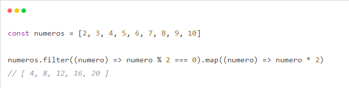
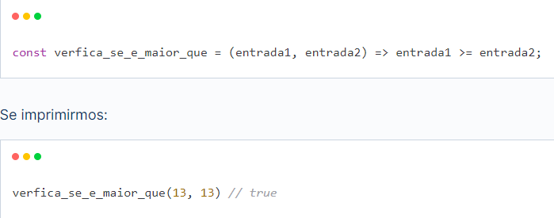
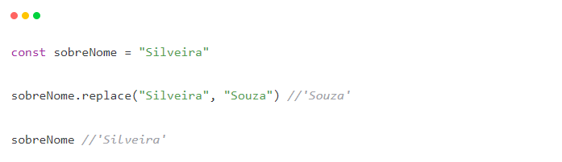
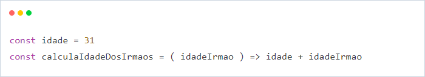

## 💡 Aprendendo Atualmente

Estou focado em aprimorar minhas habilidades em diferentes áreas. 
<br>
Aqui estão alguns dos tópicos que estou explorando:


### 🧑‍💻 [Programação Funcional]
<ul>
	<li>Paradigma de Programação: Trata a programação como se fossem funções matemáticas.</li>
	<li>Imutabilidade: uma vez que o valor é atribuído a uma variável ele nunca deve ser mudado.</li>
	<li>Stateles: sem influenciar o retorno.</li>
	<li>Funções tem que ser independentes, possuírem argumento, retornar algo e não existem loops (Loops deve ser feitos através da recursão).</li>
	<li>Bate de frente com a programação Imperativa.</li>
</ul>
As funções devem ser puras sem depender de dados externos e sem depender de dados colaterais.

```python
def soma(val1, val2):
    return val1 + val2
```

```python
canal = lambda x:x
lista = list(map[str, canal('DCFTV')])
print(lista)
```
---
<ul> 
    <li>Lambda: Funções anônimas, passar uma função como argumento para outra.</li>
	<li>Map: Recebe uma lista e transforma em outra lista</li>
	<li>Filter: Pega uma lista e aplica uma regra, contra a regra booleana.</li>
</ul>

<b>Funções como objeto de primeira classe:</b><br>
	• Em programação funcional, as funções são tratadas como objetos de primeira classe, o que significa que elas podem ser atribuídas a variáveis, passadas como argumentos para outras funções, retornadas como valores de outras funções e armazenadas em estruturas de dados.<br>
	• Isso permite que você trate as funções da mesma forma que trataria qualquer outro dado, tornando-as flexíveis e poderosas para construir abstrações e estruturas de código mais complexas.<br><br>
<b>Funções de ordem superior:</b><br>
	• Funções de ordem superior são aquelas que aceitam uma ou mais funções como argumentos e/ou retornam funções como resultados.<br>
	• Elas são fundamentais na programação funcional, pois permitem a criação de abstrações de alto nível, como mapeamento, filtragem e redução, que podem ser aplicadas a diferentes tipos de dados.<br>
	• Exemplos comuns de funções de ordem superior incluem map, filter, reduce e apply.<br><br>
<b>Funções puras:</b><br>
	• Funções puras são funções que produzem o mesmo resultado para a mesma entrada e não têm efeitos colaterais observáveis.<br>
	• Isso significa que uma função pura não modifica variáveis externas, não faz leitura/escrita de arquivos, nem possui qualquer comportamento que afete o estado global do programa.<br>
	• Funções puras são previsíveis, testáveis e podem ser facilmente paralelizadas, o que facilita a construção de código robusto e concorrente.<br><br>
<b>Recursão:</b><br>
	• A recursão é uma técnica onde uma função chama a si mesma para resolver um problema.<br>
	• Na programação funcional, a recursão é frequentemente usada em vez de loops para processar dados de forma iterativa.<br>
	• A recursão permite que você quebre um problema em subproblemas menores e, eventualmente, combine os resultados para obter a solução final.<br><br>
<b>Foco no que deve ser computado e não em como computar:</b><br>
	• A programação funcional enfatiza a declaração de quais cálculos devem ser realizados, em vez de descrever explicitamente como esses cálculos devem ser executados.<br>
	• Isso é alcançado por meio de expressões declarativas e funções de alto nível que abstraem detalhes de implementação.<br>
	• Essa abordagem permite um código mais conciso e legível, tornando mais fácil a compreensão e manutenção do código.<br><br>
<b>Lazy Evaluation:</b><br>
	• Lazy evaluation (avaliação preguiçosa) é uma estratégia em que as expressões não são avaliadas até que seu valor seja realmente necessário.<br>
	• Isso é especialmente útil quando se lida com estruturas de dados potencialmente grandes, como listas infinitas.<br>
	• A lazy evaluation pode economizar recursos, pois apenas os elementos necessários são calculados e evita cálculos desnecessários.<br>

Código feito com o paradigma funcional fica com a manutenção mais fácil, pode ser realizando processamento em paralelo e fica mais fácil fazer teste.

---

<h1>Composição de função</h1>

Composição de funções é criar uma nova função através da composição de outras. Por exemplo, vamos criar uma função que vai filtrar um array, filtrando somente os números pares e multiplicando por dois:



---

<h1>Funções Puras</h1>

Uma função é chamada pura quando invocada mais de uma vez produz exatamente o mesmo resultado. Isto é, o retorno da função é sempre o mesmo se você passar os mesmos parâmetros, então ela não pode depender de valores mutáveis. Por outro lado, ela não pode causa efeitos colaterais externos, pois se ela imprime uma linha de saída, altera algo no banco, lança um foguete para o espaço, ao invocá-la a segunda vez ela vai causar um novo efeito.



A função verifica_se_e_maior_que() é pura porque atende todos os requisitos listados. Por não causar efeito colateral e por não usar valores mutáveis compartilhados, seus resultados podem ser cacheados e ela pode ser executada em paralelo sem maiores preocupações.

---

<h1>Mutabilidade</h1>

Imutabilidade significa que uma vez que uma variável que recebeu um valor, vai possuir esse valor para sempre, ou quando criamos um objeto ele não pode ser modificado.
O objeto string do JavaScript por exemplo é imutável:



---

<h1>Efeito Colateral</h1>

Efeito colateral é toda interação da nossa função com o mundo externo No nosso dia a dia fazemos coisas como:
	• Acessar banco de dados;
	• Realizar chamadas assíncronas,
	• Alterar propriedades de objetos entre outras tarefas
E nem sempre podemos prever esse resultado.
Mas dissemos antes que funções puras não possuem efeito coleateral certo ? Mas programamos para um mundo onde dados mudam constantemente.
Então a programação funcional não elimina efeitos colaterais totalmente, mas tentam confiná-los. Como fazemos interface com o mundo real, algumas partes do programa vão ser impuras então o papel é minimizar essas partes e separá-las do resto do programa.

---

<h1>Imperativo x Declarativo</h1>

É muito comum aprender a programar de forma imperativa, onde mandamos alguém fazer algo. Busque o usuário 15 no banco de dados. Valide essas informações do usuário.
Na programação funcional tentamos programar de forma declarativa, onde declaramos o que desejamos, sem explicitar como será feito. Qual o usuário 15? Quais os erros dessas informações?

---

<h1>Estado Compartilhado</h1>

Estado compartilhado é qualquer valor que está acessível por mais de um ponto de uma aplicação. Por exemplo:



Neste caso a função calculaIdadeDosIrmaos() utiliza uma variável externa que está fora do seu escopo e não depende apenas dos argumentos passados.

---

### 🧑‍💻 [Recursividade]

Está ligada a matemática.

Definição: Objeto que se defini em termos de si próprio.
Função que chama ela mesma até a sua resolução. Dividir a resolução de um problema grande em vários probleminhas.

3 Leis:
	- Algoritmo recursivo deve ter um caso básico, ou seja ter um fim.
	- Um algoritmo recursivo deve mudar seu estado e se aproximar do estado básico.
	- Um algoritmo recursivo deve chamar a si mesmo recursivamente.

Fim previsto -> a cada chamada se aproxima do fim -> chama a si mesmo.

Recursão direta: chama a si mesmo
Recursão indireta: A primeira função chama uma segunda função que por sua vez chama a primeira função novamente.
Recursão recursiva em cauda: A chamada da recursividade é a última instrução a ser chamada.
Recursão No-tail: Função sem cauda, chamada da recursão não é a última instrução e você utiliza o resultado do retorno para realizar alguma instrução.

```python
def multiplica(num1, num2):
    if num1 == 0 or num2 == 0:
        return 0
    elif num2 == 1:
        return num1
    else:
        return num1 + multiplica(num1, num2 - 1)

result = multiplica(5, 4)
print(result)
```